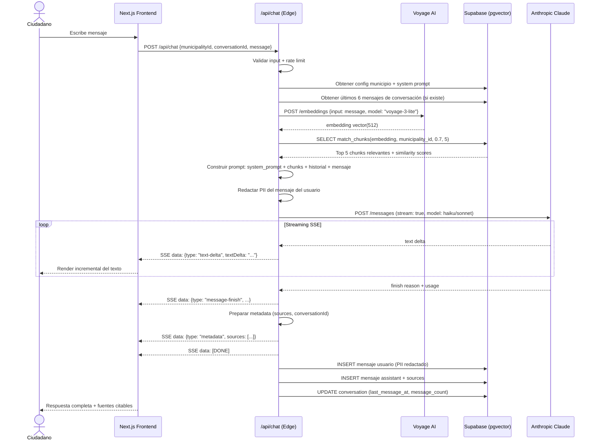
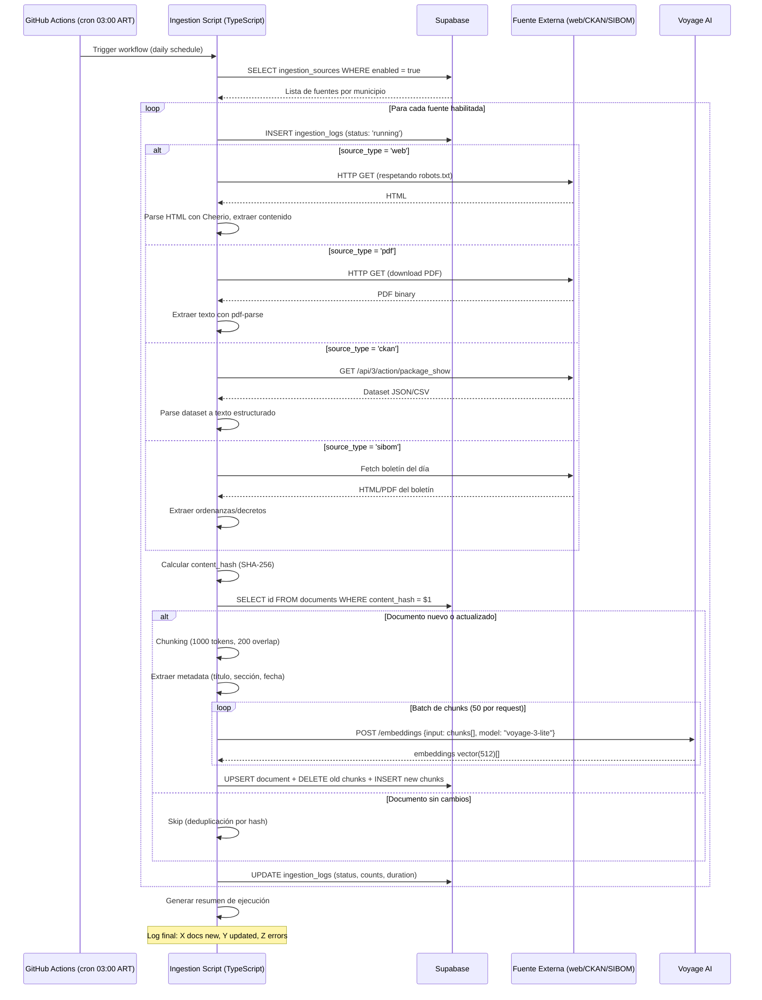

# Arquitectura Técnica — MunicipIA

## 1. Información del documento

| Campo | Valor |
|-------|-------|
| Proyecto | MunicipIA — Red federada de agentes de IA municipales |
| Versión | 0.1 (Propuesta — Iteración 1) |
| Autores | Nikola Tesla (Arquitecto) + Linus Torvalds (Líder Técnico) |
| Fecha | 2026-04-02 |
| Estado | EN ITERACION — pendiente aprobación del usuario |

---

## 2. Propuesta de Stack por Capa

### 2.1 Frontend

| Criterio | Opción A: Next.js 15 + TypeScript | Opción B: Astro + React Islands |
|----------|----------------------------------|----------------------------------|
| Descripción | App Router, RSC, streaming SSR. Chat como client component, landing como server component | Astro para landing estática, React islands solo para el chat interactivo |
| Estilos | Tailwind CSS + shadcn/ui | Tailwind CSS + shadcn/ui |
| State | Zustand (minimal, para chat state) | Zustand (solo en islands) |
| Pros | Un solo framework, SSR streaming para chat, gran ecosistema, Vercel-native, AI SDK integrado | Landing ultra-rápida (0 JS), mejor Lighthouse score |
| Contras | Más JS enviado en landing que lo necesario | Dos mental models (Astro + React), menos soporte en Vercel para edge cases, AI SDK requiere adaptación |
| Costo | Gratis (Vercel free tier: 100GB BW) | Gratis (Vercel free tier) |
| Mantenimiento | Bajo — equipo Streambe ya conoce Next.js | Medio — requiere conocer Astro + React |

**Recomendación: Opción A — Next.js 15 + TypeScript + Tailwind + shadcn/ui + Zustand.**
Justificación: stack unificado, Vercel-native, AI SDK de Vercel tiene soporte first-class para streaming de respuestas LLM, equipo ya lo conoce. La diferencia de performance en landing es marginal y no justifica la complejidad adicional.

---

### 2.2 Backend / API

| Criterio | Opción A: Next.js API Routes (monolito) | Opción B: Servidor separado (Hono on Cloudflare Workers) |
|----------|------------------------------------------|----------------------------------------------------------|
| Descripción | API Routes dentro del mismo proyecto Next.js. Route handlers para chat, ingestion triggers, admin | Backend separado en Hono desplegado en Cloudflare Workers |
| API Style | REST + Server-Sent Events (SSE) para streaming | REST + SSE |
| Pros | Un solo deploy, un solo repo, Vercel AI SDK integrado, sin latencia de red entre frontend y API, simplicidad total | Mejor separación de concerns, Workers free tier generoso (100K req/día), no consume funciones serverless de Vercel |
| Contras | Vercel free tier limita ejecución serverless a 10s (Hobby) — insuficiente para respuestas LLM de 15s. Requiere upgrade a Pro ($20/mo) o streaming con edge runtime | Dos deploys, más complejidad operacional, hay que manejar CORS, dos plataformas |
| Costo | Vercel Hobby gratis pero con límite de 10s; Vercel Pro $20/mo para 60s timeout | Cloudflare Workers free: 100K req/día, sin timeout restrictivo |

**Recomendación: Opción A — Next.js API Routes, pero usando Edge Runtime para las rutas de chat (streaming).** Edge Runtime en Vercel no tiene el límite de 10s de las serverless functions — permite streaming indefinido. Las rutas de ingestion se ejecutan fuera de Vercel (ver sección 2.6). Esto mantiene un solo deploy y máxima simplicidad. Si el free tier de Vercel resulta insuficiente en producción, migrar el backend a Hono/Workers es una salida viable.

---

### 2.3 Base de datos principal (conversaciones, config, logs de ingestion)

| Criterio | Opción A: Supabase (PostgreSQL) | Opción B: Turso (libSQL/SQLite distribuido) |
|----------|----------------------------------|---------------------------------------------|
| Descripción | PostgreSQL managed con RLS, Realtime, Auth (no usamos auth pero sí RLS y API REST auto) | SQLite distribuido, edge-native, réplicas de lectura globales |
| Free tier | 500MB, 2 proyectos, 50K MAU, 500MB storage, 1GB transfers | 9GB storage, 500 databases, 25B row reads/mo |
| Pros | PostgreSQL completo, extensiones (pgvector!), RLS para aislamiento por municipio, dashboard, backups, API REST auto-generada, gran comunidad | Ultra barato, edge-native, latencia bajísima, generous free tier |
| Contras | Free tier limitado en storage (500MB) — puede quedar justo con historial + evidence store | No tiene pgvector, no tiene RLS nativo, ecosistema más chico, sin extensiones |
| Costo | Gratis hasta 500MB, luego $25/mo Pro | Gratis hasta 9GB |

**Recomendación: Opción A — Supabase.** Razón determinante: pgvector. Usar Supabase tanto para datos relacionales como para el índice vectorial elimina un servicio externo completo. RLS permite aislamiento por municipio a nivel de base de datos. El free tier de 500MB es suficiente para MVP (8 municipios, historial anonimizado con retención de 90 días).

---

### 2.4 Base de datos vectorial (RAG)

| Criterio | Opción A: pgvector en Supabase (misma DB) | Opción B: Servicio dedicado (Qdrant Cloud / Pinecone) |
|----------|---------------------------------------------|--------------------------------------------------------|
| Descripción | Extensión pgvector dentro de la misma instancia Supabase. Tablas con columnas vector, índices HNSW | Servicio managed especializado en búsqueda vectorial |
| Free tier | Incluido en Supabase free | Qdrant: 1GB gratis. Pinecone: 100K vectors gratis |
| Pros | Cero servicios adicionales, queries JOIN entre vectores y metadata, RLS aplica también a vectores, un solo backup | Mejor performance a gran escala, más features (filtering, namespaces), optimizado para vector search |
| Contras | Performance inferior a servicios dedicados para millones de vectores (irrelevante para 8 municipios), HNSW usa RAM | Otro servicio, otro vendor, latencia de red adicional, más complejidad |
| Costo | $0 adicional | $0 (free tier) pero con límites |

**Recomendación: Opción A — pgvector en Supabase.** Para 8 municipios con documentos municipales, estamos hablando de decenas de miles de vectores como máximo. pgvector con índice HNSW maneja esto sin problema. Eliminar un servicio externo reduce complejidad y costo a cero.

---

### 2.5 Embeddings

| Criterio | Opción A: Voyage AI (voyage-3-lite) | Opción B: OpenAI text-embedding-3-small | Opción C: Local con sentence-transformers |
|----------|--------------------------------------|------------------------------------------|-------------------------------------------|
| Descripción | API de embeddings de Voyage AI, optimizado para RAG | API de OpenAI, modelo small económico | Modelo local (e.g., paraphrase-multilingual-MiniLM-L12-v2) ejecutado en el pipeline |
| Dimensiones | 512 | 1536 (reducible a 256-512) | 384 |
| Calidad español | Muy buena (multilingüe de fábrica) | Buena | Buena para multilingual MiniLM |
| Costo | 200M tokens gratis al signup, luego $0.02/1M tokens | $0.02/1M tokens, sin free tier significativo | $0 (CPU), pero requiere servidor con RAM |
| Pros | Free tier generoso, buena calidad, baja dimensionalidad = menos storage | Gran ecosistema, documentación abundante | Costo cero permanente, sin dependencia externa |
| Contras | Vendor menos conocido | Sin free tier generoso, agrega otro vendor (ya tenemos Anthropic) | Requiere servidor con 2GB+ RAM para el modelo, latencia mayor, hay que hostear |

**Recomendación: Opción A — Voyage AI (voyage-3-lite).** El free tier de 200M tokens cubre la ingestion inicial de los 8 municipios holgadamente. 512 dimensiones es un buen balance calidad/storage. Post free-tier, el costo es despreciable para volúmenes municipales. Si Voyage deja de ser viable, migrar a OpenAI embeddings es trivial (cambiar una llamada API).

---

### 2.6 Pipeline de Ingestion

| Criterio | Opción A: GitHub Actions (cron) + scripts TypeScript | Opción B: Servidor dedicado (Railway/Fly.io) con cron |
|----------|-------------------------------------------------------|--------------------------------------------------------|
| Descripción | Workflows de GitHub Actions programados con cron, ejecutan scripts de scraping/ingestion en el runner | Pequeño servidor always-on que ejecuta cron jobs |
| Scraping | Cheerio (HTML parsing) + fetch. Respeta robots.txt | Igual |
| Orquestación | Un workflow por fuente de datos, paralelismo con matrix strategy | Node-cron o similar |
| Pros | Gratis (2000 min/mo en repos públicos — open source), sin servidor que mantener, logs nativos, re-run manual fácil | Más control, sin límites de tiempo de GitHub, puede tener state local |
| Contras | Límite de 6h por job (sobra), 2000 min/mo puede ser justo si hay muchos scrapers, no hay state persistente entre runs | Costo (Railway: $5/mo mínimo con Hobby), otro servicio que mantener |
| Costo | $0 (open source = 2000 min gratis) | $5-7/mo |

**Recomendación: Opción A — GitHub Actions.** Para un pipeline diario de 8 municipios + fuentes CKAN/SIBOM, estimamos ~30-60 min/día de ejecución = ~900-1800 min/mo. Entra holgado en el free tier de repos públicos. El pipeline es stateless (lee fuentes, procesa, escribe en Supabase). Si crece a 135 municipios, se puede migrar a servidor dedicado.

---

### 2.7 Infraestructura / Cloud

| Componente | Servicio | Tier | Costo |
|------------|----------|------|-------|
| Frontend + API | Vercel (Hobby) | Free | $0 |
| Base de datos + vectores | Supabase (Free) | Free | $0 |
| Pipeline ingestion | GitHub Actions | Free (open source) | $0 |
| DNS / dominio | municipia.org.ar (ya registrado o por registrar) | - | ~$15/año |
| CDN | Vercel Edge Network (incluido) | Free | $0 |

No se necesitan containers. Todo es serverless/managed.

---

### 2.8 CI/CD

| Criterio | Opción A: GitHub Actions | Opción B: Vercel CI nativo |
|----------|--------------------------|----------------------------|
| Descripción | Workflows para lint, test, build. Vercel para deploy | Vercel hace build + deploy automático en push |
| Pros | Control total, matrix testing, reusable workflows | Zero config, integrado |
| Contras | Más config inicial | Sin etapa de lint/test pre-deploy (solo build) |

**Recomendación: Ambos combinados.** GitHub Actions para lint + test (pre-merge). Vercel para build + deploy (post-merge). Flujo: PR abierto -> GH Actions: lint, test -> Vercel: preview deploy -> merge -> Vercel: production deploy.

---

### 2.9 Monitoreo

| Criterio | Opción A: Vercel Analytics + Supabase Dashboard + logs custom | Opción B: Sentry + Grafana Cloud |
|----------|---------------------------------------------------------------|----------------------------------|
| Descripción | Usar lo que ya viene gratis con Vercel y Supabase. Tabla de logs en Supabase para métricas custom (conversaciones/municipio, errores ingestion) | Sentry para error tracking, Grafana Cloud para dashboards |
| Pros | $0, sin servicios adicionales, suficiente para MVP | Mejor UX para debugging, alertas, dashboards profesionales |
| Contras | Dashboard manual (queries a Supabase), sin alertas automáticas | Sentry free: 5K events/mo (puede ser justo), Grafana free: 10K métricas |
| Costo | $0 | $0 (free tiers) pero complejidad |

**Recomendación: Opción A para MVP.** Tabla `logs` en Supabase + Vercel Analytics cubre las necesidades del MVP. Las métricas clave (conversaciones/municipio, uptime, errores) se pueden consultar con SQL. Si el proyecto crece, agregar Sentry es trivial (npm install, wrap API routes).

---

### 2.10 Autenticación (admin/API)

No hay autenticación de usuarios finales. Para proteger endpoints internos (admin, triggers de ingestion):

| Criterio | Opción A: API Key simple (env var) | Opción B: Supabase Auth (service role) |
|----------|-------------------------------------|----------------------------------------|
| Pros | Trivial de implementar, cero overhead | Integrado con Supabase RLS |
| Contras | Sin rotación automática, sin audit | Overhead innecesario para un solo admin |

**Recomendación: Opción A — API Key en variable de entorno.** Un `ADMIN_API_KEY` en Vercel env vars para proteger endpoints de ingestion y admin. Para el free tier sin usuarios autenticados, esto es suficiente. Rate limiting con middleware de Next.js.

---

## 3. Stack Recomendado Completo

| Capa | Tecnología | Justificación |
|------|-----------|---------------|
| **Frontend** | Next.js 15 + TypeScript + Tailwind + shadcn/ui | Vercel-native, streaming SSR, AI SDK |
| **State** | Zustand | Minimal, para estado del chat |
| **Backend** | Next.js API Routes (Edge Runtime para chat) | Monolito simple, un solo deploy |
| **LLM** | Claude (Anthropic API) via Vercel AI SDK | Definido por el usuario |
| **Base de datos** | Supabase (PostgreSQL + pgvector) | Relacional + vectorial en uno, RLS, free |
| **Embeddings** | Voyage AI (voyage-3-lite, 512d) | Free tier generoso, buena calidad multilingüe |
| **Pipeline ingestion** | GitHub Actions (cron) + Cheerio + TypeScript | Gratis para open source, stateless |
| **Hosting frontend+API** | Vercel (Hobby) | Free, edge network global |
| **CI/CD** | GitHub Actions + Vercel | Lint/test en GH, build/deploy en Vercel |
| **Monitoreo** | Vercel Analytics + tabla logs en Supabase | $0, suficiente para MVP |
| **Admin auth** | API Key (env var) + rate limiting middleware | Simple, efectivo |
| **Dominio** | municipia.org.ar | DNS en Vercel |

### Diagrama de componentes (texto)

```
                    ┌─────────────────────────────────┐
                    │          municipia.org.ar        │
                    │      Vercel Edge Network (CDN)   │
                    └──────────────┬──────────────────┘
                                   │
                    ┌──────────────▼──────────────────┐
                    │         Next.js 15 App           │
                    │  ┌───────────┐ ┌──────────────┐  │
                    │  │  Landing  │ │  Chat UI     │  │
                    │  │  (SSR)    │ │  (Client)    │  │
                    │  └───────────┘ └──────┬───────┘  │
                    │                       │          │
                    │  ┌────────────────────▼───────┐  │
                    │  │    API Routes (Edge)       │  │
                    │  │  /api/chat (SSE streaming) │  │
                    │  │  /api/feedback             │  │
                    │  │  /api/admin/*              │  │
                    │  └─────────┬──────────────────┘  │
                    └────────────┼──────────────────────┘
                                 │
              ┌──────────────────┼──────────────────────┐
              │                  │                       │
    ┌─────────▼────────┐ ┌──────▼───────┐  ┌───────────▼──────────┐
    │  Anthropic API   │ │   Supabase   │  │     Voyage AI        │
    │  (Claude)        │ │  PostgreSQL  │  │  (embeddings)        │
    │                  │ │  + pgvector  │  │                      │
    │  - Chat/completions│ │  - conversations│ │  - voyage-3-lite   │
    │  - ReAct agents  │ │  - documents │  │  - 512 dimensions    │
    └──────────────────┘ │  - vectors   │  └──────────────────────┘
                         │  - logs      │
                         │  - config    │
                         └──────────────┘
                                 ▲
                                 │
              ┌──────────────────┴──────────────────┐
              │        GitHub Actions (cron)         │
              │  ┌──────────┐ ┌──────────┐ ┌──────┐ │
              │  │ Scraper  │ │ CKAN     │ │SIBOM │ │
              │  │ municipal│ │ connector│ │conn. │ │
              │  └──────────┘ └──────────┘ └──────┘ │
              └─────────────────────────────────────┘
```

---

## 4. Estimación de Costos Mensuales

| Servicio | Free tier | Uso estimado MVP | Costo mensual |
|----------|-----------|------------------|---------------|
| Vercel Hobby | 100GB BW, edge functions | ~5-10GB BW, ~50K req/mo | **$0** |
| Supabase Free | 500MB DB, 1GB transfer | ~200MB DB, ~500K reads | **$0** |
| Anthropic API (Claude) | Sin free tier | ~50 conv/día x 30 = 1500 conv/mo x ~2K tokens = 3M tokens/mo | **~$15-30/mo** (*)  |
| Voyage AI | 200M tokens gratis | Ingestion diaria: ~1M tokens/mo | **$0** (free tier) |
| GitHub Actions | 2000 min/mo (OSS) | ~900-1800 min/mo | **$0** |
| Dominio .org.ar | - | Anual | **~$1.25/mo** (~$15/año) |
| **TOTAL** | | | **~$16-31/mo** |

(*) El costo de Anthropic API es el único gasto significativo y ya está cubierto por Streambe. El costo exacto depende del modelo usado (Haiku vs Sonnet) y la longitud promedio de conversaciones. Usando Claude 3.5 Haiku para el chat (más económico), el costo baja a ~$5-10/mo.

**Nota de optimización**: Usar Claude 3.5 Haiku para respuestas conversacionales estándar y Claude Sonnet solo para consultas complejas que requieran reasoning avanzado. Esto puede reducir el costo de API en un 60-70%.

---

## 5. ADR-001: Stack Tecnológico MunicipIA

```
# ADR-001: Stack Tecnológico para MunicipIA MVP
Fecha: 2026-04-02
Estado: Propuesto (pendiente aprobación)

## Contexto
MunicipIA es un proyecto open source de RSE con presupuesto cero (excepto API Anthropic).
Necesita soportar 8 municipios con chat IA, RAG, pipeline de ingestion diaria,
y 50 conversaciones simultáneas con respuesta < 3s primer token.

## Opciones Consideradas

### Opción A: Monolito Next.js + Supabase (RECOMENDADA)
- Frontend y API en un solo proyecto Next.js, Supabase como DB+vectores
- Pros: mínimo costo ($0 infra), mínima complejidad, un solo deploy, 
  equipo Streambe ya conoce el stack, Vercel AI SDK para streaming
- Contras: acoplamiento frontend/backend, Vercel Hobby tiene límites

### Opción B: Frontend Next.js + Backend separado (Hono/Workers) + DB dedicada
- Frontend en Vercel, backend en Cloudflare Workers, Qdrant para vectores
- Pros: mejor separación de concerns, Workers sin timeout, vectores dedicados
- Contras: 3 servicios separados, más complejidad operacional, CORS, 
  múltiples deploys, equipo necesita aprender Hono + Workers + Qdrant

## Decisión
Opción A: Monolito Next.js + Supabase (pgvector) + Vercel.

## Rationale
1. COSTO: $0 en infraestructura. Solo se paga API Anthropic (~$15-30/mo).
2. SIMPLICIDAD: un solo repo, un solo deploy, una sola base de datos.
3. COMPETENCIA: Streambe trabaja con Next.js + Supabase.
4. PERFORMANCE: Edge Runtime de Vercel permite streaming sin timeout.
   pgvector es suficiente para decenas de miles de vectores.
5. ESCALABILIDAD: si crece a 135 municipios, se puede extraer el backend
   a un servicio separado sin reescribir el frontend.

## Consecuencias
- Si Vercel Hobby no alcanza en producción (rate limits, BW), hay que
  evaluar Pro ($20/mo) o migrar API a Cloudflare Workers.
- pgvector comparte recursos con la DB relacional. Si los vectores crecen
  mucho, migrar a servicio vectorial dedicado.
- Pipeline de ingestion en GitHub Actions funciona bien para open source
  pero tiene límite de 2000 min/mo. Monitorear uso mensual.
- Voyage AI puede cambiar sus free tiers. Tener OpenAI embeddings como
  plan B (misma interfaz, solo cambiar API key + modelo).
```

---

## 6. Decisiones de Diseño Clave

### 6.1 Aislamiento por municipio

Cada municipio tiene su propio índice vectorial y datos aislados mediante Supabase RLS (Row Level Security). Todas las tablas llevan una columna `municipality_id`. Las políticas RLS garantizan que un query de chat del municipio A nunca acceda a documentos del municipio B.

### 6.2 Streaming de respuestas LLM

Se usa Vercel AI SDK con Edge Runtime para streaming SSE. El primer token llega en < 3s (objetivo del NFR). El Edge Runtime no tiene el límite de 10s de las serverless functions regulares de Vercel.

### 6.3 RAG Architecture

```
Query del ciudadano
  → Embedding con Voyage AI (voyage-3-lite)
  → Búsqueda vectorial en pgvector (filtrado por municipality_id)
  → Top-K documentos relevantes (K=5)
  → Prompt con contexto + system prompt del municipio
  → Claude genera respuesta con streaming
```

### 6.4 Pipeline de ingestion

```
GitHub Actions cron (diario, 03:00 UTC-3)
  → Scraper por municipio (Cheerio + fetch, respeta robots.txt)
  → Conectores CKAN/SIBOM/etc
  → Chunking (RecursiveCharacterTextSplitter, 1000 tokens, 200 overlap)
  → Embedding batch con Voyage AI
  → Upsert en Supabase (pgvector + metadata)
  → Log de ingestion en tabla logs
```

---

---

## 7. Schemas de Base de Datos

Supabase (PostgreSQL) con extensiones `pgvector` y `uuid-ossp`.

### 7.1 Extensiones

```sql
CREATE EXTENSION IF NOT EXISTS "uuid-ossp";
CREATE EXTENSION IF NOT EXISTS "vector";
```

### 7.2 Tabla `municipalities`

```sql
CREATE TABLE municipalities (
  id UUID PRIMARY KEY DEFAULT uuid_generate_v4(),
  slug TEXT NOT NULL UNIQUE,               -- e.g. "san-isidro"
  name TEXT NOT NULL,                       -- "Municipalidad de San Isidro"
  province TEXT NOT NULL DEFAULT 'Buenos Aires',
  phone TEXT,                               -- teléfono de atención
  website TEXT,                             -- URL del sitio oficial
  email TEXT,                               -- email de contacto
  address TEXT,                             -- dirección física
  agent_name TEXT NOT NULL DEFAULT 'Asistente Municipal',  -- nombre del chatbot
  agent_welcome_message TEXT,               -- mensaje de bienvenida custom
  system_prompt_override TEXT,              -- override parcial del system prompt
  timezone TEXT NOT NULL DEFAULT 'America/Argentina/Buenos_Aires',
  enabled BOOLEAN NOT NULL DEFAULT true,
  metadata JSONB DEFAULT '{}',             -- datos extra flexibles
  created_at TIMESTAMPTZ NOT NULL DEFAULT now(),
  updated_at TIMESTAMPTZ NOT NULL DEFAULT now()
);

CREATE INDEX idx_municipalities_slug ON municipalities (slug);
CREATE INDEX idx_municipalities_enabled ON municipalities (enabled) WHERE enabled = true;
```

### 7.3 Tabla `documents`

```sql
CREATE TABLE documents (
  id UUID PRIMARY KEY DEFAULT uuid_generate_v4(),
  municipality_id UUID NOT NULL REFERENCES municipalities(id) ON DELETE CASCADE,
  source_type TEXT NOT NULL,               -- 'web', 'pdf', 'ckan', 'sibom', 'social'
  source_url TEXT,                          -- URL original del documento
  title TEXT,
  content_hash TEXT NOT NULL,              -- SHA-256 del contenido (deduplicación)
  content_length INTEGER,                  -- longitud en caracteres
  mime_type TEXT,
  language TEXT DEFAULT 'es',
  metadata JSONB DEFAULT '{}',             -- datos extra: autor, fecha publicación, categoría
  ingested_at TIMESTAMPTZ NOT NULL DEFAULT now(),
  updated_at TIMESTAMPTZ NOT NULL DEFAULT now(),
  expires_at TIMESTAMPTZ,                  -- para contenido con expiración (ej: trámites temporales)
  UNIQUE(municipality_id, content_hash)
);

CREATE INDEX idx_documents_municipality ON documents (municipality_id);
CREATE INDEX idx_documents_source_type ON documents (municipality_id, source_type);
CREATE INDEX idx_documents_hash ON documents (content_hash);
```

### 7.4 Tabla `document_chunks`

```sql
CREATE TABLE document_chunks (
  id UUID PRIMARY KEY DEFAULT uuid_generate_v4(),
  document_id UUID NOT NULL REFERENCES documents(id) ON DELETE CASCADE,
  municipality_id UUID NOT NULL REFERENCES municipalities(id) ON DELETE CASCADE,
  chunk_index INTEGER NOT NULL,            -- orden dentro del documento
  content TEXT NOT NULL,                    -- texto del chunk
  embedding vector(512) NOT NULL,          -- Voyage AI voyage-3-lite
  token_count INTEGER,
  metadata JSONB DEFAULT '{}',             -- section_title, page_number, etc.
  created_at TIMESTAMPTZ NOT NULL DEFAULT now()
);

-- HNSW index para búsqueda vectorial rápida (cosine distance)
CREATE INDEX idx_chunks_embedding ON document_chunks
  USING hnsw (embedding vector_cosine_ops)
  WITH (m = 16, ef_construction = 64);

-- Btree para filtrado por municipio antes de vector search
CREATE INDEX idx_chunks_municipality ON document_chunks (municipality_id);
CREATE INDEX idx_chunks_document ON document_chunks (document_id);
```

### 7.5 Tabla `conversations`

```sql
CREATE TABLE conversations (
  id UUID PRIMARY KEY DEFAULT uuid_generate_v4(),
  municipality_id UUID NOT NULL REFERENCES municipalities(id) ON DELETE CASCADE,
  session_id TEXT,                          -- ID de sesión anónimo (cookie/localStorage)
  started_at TIMESTAMPTZ NOT NULL DEFAULT now(),
  last_message_at TIMESTAMPTZ NOT NULL DEFAULT now(),
  message_count INTEGER NOT NULL DEFAULT 0,
  metadata JSONB DEFAULT '{}',             -- canal (web/whatsapp), user-agent, etc.
  feedback_rating INTEGER                  -- 1-5 si el usuario dio feedback
    CHECK (feedback_rating IS NULL OR (feedback_rating >= 1 AND feedback_rating <= 5))
);

CREATE INDEX idx_conversations_municipality ON conversations (municipality_id);
CREATE INDEX idx_conversations_last_message ON conversations (municipality_id, last_message_at DESC);
```

### 7.6 Tabla `messages`

```sql
CREATE TABLE messages (
  id UUID PRIMARY KEY DEFAULT uuid_generate_v4(),
  conversation_id UUID NOT NULL REFERENCES conversations(id) ON DELETE CASCADE,
  municipality_id UUID NOT NULL REFERENCES municipalities(id) ON DELETE CASCADE,
  role TEXT NOT NULL CHECK (role IN ('user', 'assistant', 'system')),
  content TEXT NOT NULL,                    -- contenido anonimizado (PII redactado)
  sources JSONB DEFAULT '[]',              -- chunks usados como contexto [{document_id, chunk_id, score}]
  token_count INTEGER,
  latency_ms INTEGER,                      -- tiempo hasta primer token (para métricas)
  model TEXT,                              -- modelo usado (haiku/sonnet)
  created_at TIMESTAMPTZ NOT NULL DEFAULT now()
);

CREATE INDEX idx_messages_conversation ON messages (conversation_id, created_at);
CREATE INDEX idx_messages_municipality ON messages (municipality_id, created_at DESC);
```

### 7.7 Tabla `ingestion_sources`

```sql
CREATE TABLE ingestion_sources (
  id UUID PRIMARY KEY DEFAULT uuid_generate_v4(),
  municipality_id UUID NOT NULL REFERENCES municipalities(id) ON DELETE CASCADE,
  source_type TEXT NOT NULL,               -- 'web', 'pdf', 'ckan', 'sibom', 'social'
  name TEXT NOT NULL,                       -- nombre descriptivo
  url TEXT NOT NULL,                        -- URL base o endpoint
  config JSONB DEFAULT '{}',               -- config específica: selectores CSS, dataset ID, etc.
  schedule TEXT DEFAULT 'daily',           -- 'daily', 'weekly', 'manual'
  enabled BOOLEAN NOT NULL DEFAULT true,
  last_run_at TIMESTAMPTZ,
  last_run_status TEXT,                    -- 'success', 'partial', 'error'
  created_at TIMESTAMPTZ NOT NULL DEFAULT now(),
  updated_at TIMESTAMPTZ NOT NULL DEFAULT now()
);

CREATE INDEX idx_ingestion_sources_municipality ON ingestion_sources (municipality_id);
CREATE INDEX idx_ingestion_sources_enabled ON ingestion_sources (enabled) WHERE enabled = true;
```

### 7.8 Tabla `ingestion_logs`

```sql
CREATE TABLE ingestion_logs (
  id UUID PRIMARY KEY DEFAULT uuid_generate_v4(),
  source_id UUID REFERENCES ingestion_sources(id) ON DELETE SET NULL,
  municipality_id UUID NOT NULL REFERENCES municipalities(id) ON DELETE CASCADE,
  status TEXT NOT NULL CHECK (status IN ('running', 'success', 'partial', 'error')),
  documents_found INTEGER DEFAULT 0,
  documents_new INTEGER DEFAULT 0,
  documents_updated INTEGER DEFAULT 0,
  chunks_created INTEGER DEFAULT 0,
  error_message TEXT,
  error_details JSONB,
  started_at TIMESTAMPTZ NOT NULL DEFAULT now(),
  completed_at TIMESTAMPTZ,
  duration_ms INTEGER
);

CREATE INDEX idx_ingestion_logs_municipality ON ingestion_logs (municipality_id, started_at DESC);
CREATE INDEX idx_ingestion_logs_status ON ingestion_logs (status) WHERE status = 'error';
```

### 7.9 RLS Policies

```sql
-- Habilitar RLS en todas las tablas
ALTER TABLE municipalities ENABLE ROW LEVEL SECURITY;
ALTER TABLE documents ENABLE ROW LEVEL SECURITY;
ALTER TABLE document_chunks ENABLE ROW LEVEL SECURITY;
ALTER TABLE conversations ENABLE ROW LEVEL SECURITY;
ALTER TABLE messages ENABLE ROW LEVEL SECURITY;
ALTER TABLE ingestion_sources ENABLE ROW LEVEL SECURITY;
ALTER TABLE ingestion_logs ENABLE ROW LEVEL SECURITY;

-- Policy: lectura pública de municipios habilitados
CREATE POLICY "municipalities_public_read" ON municipalities
  FOR SELECT USING (enabled = true);

-- Policy: chunks solo accesibles filtrados por municipality_id
-- (el backend siempre filtra por municipality_id en las queries vectoriales)
CREATE POLICY "chunks_read_by_municipality" ON document_chunks
  FOR SELECT USING (true);
  -- Nota: el filtrado real se hace en la query con WHERE municipality_id = $1.
  -- RLS aquí es una capa de defensa adicional. El service_role key bypasa RLS
  -- para operaciones de ingestion.

-- Policy: conversaciones solo accesibles por municipality_id
CREATE POLICY "conversations_by_municipality" ON conversations
  FOR SELECT USING (true);

CREATE POLICY "conversations_insert" ON conversations
  FOR INSERT WITH CHECK (true);

-- Policy: mensajes solo accesibles por municipality_id
CREATE POLICY "messages_by_municipality" ON messages
  FOR SELECT USING (true);

CREATE POLICY "messages_insert" ON messages
  FOR INSERT WITH CHECK (true);

-- Ingestion: solo service_role (pipeline) puede escribir
-- El anon key NO tiene acceso a documents, ingestion_sources, ingestion_logs
CREATE POLICY "documents_service_only" ON documents
  FOR ALL USING (false);  -- anon no puede leer/escribir

CREATE POLICY "ingestion_sources_service_only" ON ingestion_sources
  FOR ALL USING (false);

CREATE POLICY "ingestion_logs_service_only" ON ingestion_logs
  FOR ALL USING (false);
```

**Nota sobre RLS**: El frontend usa el `anon` key de Supabase, que respeta RLS. El pipeline de ingestion y los endpoints admin usan `service_role` key, que bypasa RLS. Esto garantiza que ciudadanos solo pueden leer datos públicos de municipios y sus propias conversaciones, mientras que el pipeline tiene acceso total para escritura.

### 7.10 Función de búsqueda vectorial

```sql
CREATE OR REPLACE FUNCTION match_chunks(
  query_embedding vector(512),
  filter_municipality_id UUID,
  match_threshold FLOAT DEFAULT 0.7,
  match_count INT DEFAULT 5
)
RETURNS TABLE (
  id UUID,
  document_id UUID,
  content TEXT,
  metadata JSONB,
  similarity FLOAT
)
LANGUAGE plpgsql
AS $$
BEGIN
  RETURN QUERY
  SELECT
    dc.id,
    dc.document_id,
    dc.content,
    dc.metadata,
    1 - (dc.embedding <=> query_embedding) AS similarity
  FROM document_chunks dc
  WHERE dc.municipality_id = filter_municipality_id
    AND 1 - (dc.embedding <=> query_embedding) > match_threshold
  ORDER BY dc.embedding <=> query_embedding
  LIMIT match_count;
END;
$$;
```

---

## 8. Contratos de API

Todos los endpoints se implementan como Next.js API Routes bajo `src/app/api/`.

### 8.1 Chat

#### `POST /api/chat`

Envía un mensaje y recibe una respuesta en streaming (SSE).

| Campo | Valor |
|-------|-------|
| **Runtime** | Edge |
| **Auth** | Ninguna (público) |
| **Rate limit** | 10 req/min por IP |

**Request Body:**

```json
{
  "municipalityId": "uuid",
  "conversationId": "uuid | null",
  "message": "string (max 2000 chars)"
}
```

**Response:** Server-Sent Events (Vercel AI SDK format)

```
Content-Type: text/event-stream

data: {"type":"text-delta","textDelta":"Hola"}
data: {"type":"text-delta","textDelta":", te"}
data: {"type":"text-delta","textDelta":" cuento..."}
data: {"type":"message-finish","finishReason":"stop","usage":{"promptTokens":450,"completionTokens":120}}
data: {"type":"metadata","conversationId":"uuid","sources":[{"documentId":"uuid","title":"...","score":0.85}]}
data: [DONE]
```

**Status Codes:**

| Code | Meaning |
|------|---------|
| 200 | Stream iniciado |
| 400 | `municipalityId` inválido o faltante, mensaje vacío o > 2000 chars |
| 404 | Municipio no encontrado o deshabilitado |
| 429 | Rate limit excedido |
| 500 | Error interno (Anthropic API down, Supabase error) |

**Comportamiento:**
1. Valida input y rate limit
2. Si `conversationId` es null, crea nueva conversación
3. Genera embedding del mensaje con Voyage AI
4. Busca top-5 chunks relevantes en pgvector (filtrado por municipalityId)
5. Construye prompt con system prompt + chunks + historial reciente (últimos 6 mensajes)
6. Llama a Claude API con streaming via Vercel AI SDK
7. Hace stream SSE al cliente
8. Al finalizar: guarda mensaje del usuario (PII redactado) y respuesta en DB
9. Envía metadata al final del stream (conversationId, sources)

---

### 8.2 Conversations

#### `POST /api/conversations`

Crea una nueva conversación (llamada automáticamente por `/api/chat` si no se envía `conversationId`).

| Campo | Valor |
|-------|-------|
| **Runtime** | Edge |
| **Auth** | Ninguna |
| **Rate limit** | 5 req/min por IP |

**Request Body:**

```json
{
  "municipalityId": "uuid"
}
```

**Response (201):**

```json
{
  "id": "uuid",
  "municipalityId": "uuid",
  "startedAt": "2026-04-02T10:30:00Z"
}
```

**Status Codes:** 201 (created), 400 (invalid municipalityId), 404 (municipality not found), 429.

---

#### `GET /api/conversations/:id`

Obtiene el historial de una conversación.

| Campo | Valor |
|-------|-------|
| **Runtime** | Edge |
| **Auth** | Ninguna |
| **Rate limit** | 20 req/min por IP |

**Response (200):**

```json
{
  "id": "uuid",
  "municipalityId": "uuid",
  "startedAt": "2026-04-02T10:30:00Z",
  "messages": [
    {
      "id": "uuid",
      "role": "user",
      "content": "Qué trámites necesito para una habilitación comercial?",
      "createdAt": "2026-04-02T10:30:05Z"
    },
    {
      "id": "uuid",
      "role": "assistant",
      "content": "Para tramitar una habilitación comercial en...",
      "sources": [
        { "documentId": "uuid", "title": "Trámites - Habilitaciones", "score": 0.92 }
      ],
      "createdAt": "2026-04-02T10:30:08Z"
    }
  ]
}
```

**Status Codes:** 200, 404 (conversation not found).

---

#### `POST /api/conversations/:id/feedback`

Envía feedback del usuario sobre la conversación.

| Campo | Valor |
|-------|-------|
| **Runtime** | Edge |
| **Auth** | Ninguna |
| **Rate limit** | 5 req/min por IP |

**Request Body:**

```json
{
  "rating": 4,
  "comment": "string | null"
}
```

**Response (200):**

```json
{ "ok": true }
```

**Status Codes:** 200, 400 (rating fuera de rango 1-5), 404.

---

### 8.3 Municipios (público)

#### `GET /api/municipalities`

Lista municipios habilitados (para selector de chat / landing).

| Campo | Valor |
|-------|-------|
| **Runtime** | Edge |
| **Auth** | Ninguna |
| **Cache** | `s-maxage=3600, stale-while-revalidate=86400` |

**Response (200):**

```json
{
  "municipalities": [
    {
      "id": "uuid",
      "slug": "san-isidro",
      "name": "Municipalidad de San Isidro",
      "province": "Buenos Aires",
      "agentName": "Asistente de San Isidro",
      "agentWelcomeMessage": "Hola! Soy el asistente virtual de San Isidro..."
    }
  ]
}
```

---

#### `GET /api/municipalities/:slug`

Datos de un municipio por slug.

**Response (200):**

```json
{
  "id": "uuid",
  "slug": "san-isidro",
  "name": "Municipalidad de San Isidro",
  "province": "Buenos Aires",
  "phone": "011-4512-3456",
  "website": "https://www.sanisidro.gob.ar",
  "email": "consultas@sanisidro.gob.ar",
  "address": "Av. Centenario 123, San Isidro",
  "agentName": "Asistente de San Isidro",
  "agentWelcomeMessage": "Hola! Soy el asistente virtual..."
}
```

**Status Codes:** 200, 404.

---

### 8.4 Admin / Internal

Todos los endpoints admin requieren header `Authorization: Bearer <ADMIN_API_KEY>`.

#### `POST /api/admin/ingest/trigger`

Dispara ingestion manual para un municipio o fuente específica.

| Campo | Valor |
|-------|-------|
| **Runtime** | Node.js (serverless, no Edge) |
| **Auth** | API Key (header) |
| **Timeout** | 60s (Vercel Pro) o 10s (Hobby) |

**Request Body:**

```json
{
  "municipalityId": "uuid",
  "sourceId": "uuid | null"
}
```

**Response (202):**

```json
{
  "logId": "uuid",
  "status": "running",
  "message": "Ingestion started for san-isidro"
}
```

**Nota:** En Vercel Hobby (10s timeout), este endpoint solo dispara el proceso. La ingestion real corre en GitHub Actions. En Pro (60s), puede ejecutar ingestions cortas directamente.

**Status Codes:** 202 (accepted), 400, 401 (unauthorized), 404.

---

#### `GET /api/admin/stats`

Métricas generales del sistema.

| Campo | Valor |
|-------|-------|
| **Runtime** | Edge |
| **Auth** | API Key |

**Response (200):**

```json
{
  "totalMunicipalities": 8,
  "totalDocuments": 1250,
  "totalChunks": 8400,
  "totalConversations": 3200,
  "last24h": {
    "conversations": 45,
    "messages": 180,
    "avgLatencyMs": 1800
  },
  "byMunicipality": [
    {
      "id": "uuid",
      "name": "San Isidro",
      "documents": 200,
      "chunks": 1400,
      "conversations24h": 12
    }
  ]
}
```

---

#### `GET /api/admin/ingestion-logs`

Últimos logs de ingestion.

| Campo | Valor |
|-------|-------|
| **Runtime** | Edge |
| **Auth** | API Key |

**Query params:** `?municipalityId=uuid&limit=20&status=error`

**Response (200):**

```json
{
  "logs": [
    {
      "id": "uuid",
      "municipalityId": "uuid",
      "municipalityName": "San Isidro",
      "sourceId": "uuid",
      "status": "success",
      "documentsFound": 15,
      "documentsNew": 3,
      "documentsUpdated": 2,
      "chunksCreated": 18,
      "startedAt": "2026-04-02T06:00:00Z",
      "completedAt": "2026-04-02T06:03:45Z",
      "durationMs": 225000
    }
  ]
}
```

**Status Codes:** 200, 401.

---

## 9. Diagrama de Secuencia -- Flujo de Chat



---

## 10. Diagrama de Secuencia -- Pipeline de Ingestion



---

## 11. System Prompt Template

El system prompt se construye dinámicamente para cada municipio al recibir un mensaje. Se compone de una parte fija y una parte inyectada con datos del municipio.

```
Sos {{ agent_name }}, el asistente virtual oficial de {{ municipality_name }}.
Tu misión es ayudar a los ciudadanos respondiendo consultas sobre trámites, servicios, información pública y normativas del municipio.

## Comportamiento

- Respondé SOLAMENTE con información que tenés en tu base de conocimiento (los fragmentos de contexto que se te proporcionan).
- Si no tenés información suficiente para responder, decilo con honestidad. NUNCA inventes datos, números de teléfono, direcciones, plazos ni requisitos.
- Usá un tono amable, claro y accesible. Evitá jerga técnica innecesaria.
- Respondé en español rioplatense (vos/sos), acorde a la comunicación habitual de municipios argentinos.
- Sé conciso. Si la respuesta es larga, usá viñetas o listas para mayor claridad.
- Si el ciudadano saluda, respondé brevemente y preguntá en qué podés ayudar.

## Citas y fuentes

- NO cites fuentes automáticamente en cada respuesta. Solo mencioná la fuente cuando el ciudadano la pida explícitamente ("de dónde sacaste eso?", "tenés algún link?").
- Cuando cites, usá el título del documento y la URL si están disponibles en los metadatos del chunk.

## Cuando no sabés

Si no encontrás información relevante en el contexto proporcionado:
1. Decí que no tenés esa información específica en tu base de conocimiento.
2. Sugerí alternativas concretas:
   - "Podés consultar directamente en {{ website }}"
   - "Te recomiendo llamar al {{ phone }}"
   - "Podés acercarte a {{ address }}"
   - "Escribí a {{ email }} para una respuesta más detallada"
3. Si la consulta parece ser de otro municipio, indicá que solo tenés información de {{ municipality_name }}.

## Limitaciones que debés comunicar

- Si el ciudadano pregunta por plazos o costos específicos de trámites, aclarále que los valores pueden haber cambiado y que confirme en la fuente oficial.
- No realices trámites, no accedas a sistemas externos, no proceses pagos.

## Disclaimer

Si el ciudadano pregunta quién sos o cómo funcionás, explicá:
"Soy un asistente de inteligencia artificial creado para facilitar el acceso a información pública de {{ municipality_name }}. Mis respuestas se basan en documentos públicos del municipio, pero pueden no estar 100% actualizadas. Para confirmación oficial, consultá {{ website }} o llamá al {{ phone }}."

## Datos de contacto de {{ municipality_name }}

- Sitio web: {{ website }}
- Teléfono: {{ phone }}
- Email: {{ email }}
- Dirección: {{ address }}

## Contexto recuperado (documentos relevantes)

{{ retrieved_chunks }}
```

Las variables entre `{{ }}` se reemplazan en runtime desde la tabla `municipalities` y el resultado de `match_chunks`.

---

## 12. Estrategia de Chunking

### 12.1 Principios generales

- **Tamaño objetivo:** 1000 tokens (~750 palabras en español)
- **Overlap:** 200 tokens (20%) para mantener contexto entre chunks contiguos
- **Splitter:** RecursiveCharacterTextSplitter (LangChain.js) con separadores jerárquicos: `["\n\n", "\n", ". ", " "]`
- **Deduplicación:** por SHA-256 del contenido del documento completo. Si el hash no cambió, no se re-procesa.

### 12.2 Por tipo de fuente

#### HTML de sitios municipales

| Aspecto | Detalle |
|---------|---------|
| **Extracción** | Cheerio: eliminar nav, footer, sidebar, scripts, ads. Extraer `<main>` o `<article>`. |
| **Pre-procesamiento** | Convertir tablas HTML a texto tabulado. Preservar listas como viñetas. Eliminar HTML tags residuales. |
| **Chunk size** | 1000 tokens, 200 overlap |
| **Metadata extraída** | `title` (de `<title>` o `<h1>`), `url`, `section` (de `<h2>`), `last_modified` (de headers HTTP o meta tag), `municipality_slug` |
| **Deduplicación** | SHA-256 del texto extraído (no del HTML raw, para ignorar cambios cosméticos) |
| **robots.txt** | Respetar siempre. Si hay `Disallow`, no scrapear esa ruta. Log como warning. |

#### PDFs (ordenanzas, presupuestos)

| Aspecto | Detalle |
|---------|---------|
| **Extracción** | `pdf-parse` (Node.js). Extraer texto por página. |
| **Pre-procesamiento** | Eliminar headers/footers repetitivos (detección por repetición en primeras/últimas 3 líneas de cada página). Normalizar whitespace. |
| **Chunk size** | 1000 tokens, 200 overlap. Intentar cortar en límites de sección (detectar patrones como "ARTICULO", "Art.", "TITULO"). |
| **Metadata extraída** | `title` (de metadata PDF o primera línea), `page_number` (range del chunk), `url` (si se descargó de web), `document_type` ('ordenanza', 'decreto', 'presupuesto' por heurística) |
| **Deduplicación** | SHA-256 del texto completo extraído |
| **Nota** | PDFs escaneados (sin texto embebido) se omiten en MVP. OCR es una mejora futura. |

#### Datasets CSV/JSON de CKAN

| Aspecto | Detalle |
|---------|---------|
| **Extracción** | API CKAN `package_show` + `resource_show`. Descargar CSV/JSON. |
| **Pre-procesamiento** | Convertir cada fila a texto natural: "Campo1: valor1. Campo2: valor2." Agrupar filas relacionadas (misma categoría o zona). |
| **Chunk size** | 800 tokens (más cortos porque son datos estructurados, cada chunk debe ser autocontenido) |
| **Metadata extraída** | `dataset_name`, `resource_name`, `organization`, `url`, `last_updated`, `category_tags` |
| **Deduplicación** | SHA-256 del CSV/JSON descargado |
| **Nota** | Solo datasets con licencia abierta. Filtrar datasets muy grandes (> 50MB) y procesar solo las primeras 10K filas con log de warning. |

#### Boletines SIBOM

| Aspecto | Detalle |
|---------|---------|
| **Extracción** | Fetch diario del boletín publicado. Parse HTML o PDF según formato. |
| **Pre-procesamiento** | Separar por ordenanza/decreto/resolución. Cada acto administrativo es una unidad. |
| **Chunk size** | 1 acto administrativo = 1 chunk si cabe en 1500 tokens. Si excede, split con overlap de 200. |
| **Metadata extraída** | `boletin_number`, `fecha_publicacion`, `tipo_acto` ('ordenanza', 'decreto', 'resolución'), `numero_acto`, `municipality_slug` |
| **Deduplicación** | SHA-256 del texto del acto administrativo |
| **Nota** | Si SIBOM no tiene API, scraping del HTML público. Verificar frecuencia de publicación por municipio. |

#### Posts de redes sociales

| Aspecto | Detalle |
|---------|---------|
| **Extracción** | Feeds RSS si disponibles, o API oficial (Facebook Graph API, Instagram Basic Display -- requieren tokens). |
| **Pre-procesamiento** | Limpiar hashtags, mentions, URLs acortadas. Preservar el texto informativo. Descartar posts puramente visuales (sin texto). |
| **Chunk size** | 1 post = 1 chunk (generalmente < 500 tokens). No splitear posts. |
| **Metadata extraída** | `platform` ('facebook', 'instagram', 'twitter'), `post_url`, `post_date`, `municipality_slug` |
| **Deduplicación** | SHA-256 del texto del post |
| **Nota** | Prioridad baja para MVP. Las redes sociales tienen contenido volátil y menos útil para consultas de trámites. Incluir solo si el municipio lo solicita. |

---

## 13. Estructura de Carpetas del Proyecto

```
municipia/
├── src/
│   ├── app/                          # Next.js App Router
│   │   ├── layout.tsx                # Root layout (fonts, metadata, providers)
│   │   ├── page.tsx                  # Landing page (SSR)
│   │   ├── [municipality]/           # Ruta dinámica por municipio
│   │   │   └── page.tsx              # Chat UI para el municipio (client component)
│   │   └── api/                      # API Routes
│   │       ├── chat/
│   │       │   └── route.ts          # POST /api/chat (Edge Runtime, SSE streaming)
│   │       ├── conversations/
│   │       │   ├── route.ts          # POST /api/conversations
│   │       │   └── [id]/
│   │       │       ├── route.ts      # GET /api/conversations/:id
│   │       │       └── feedback/
│   │       │           └── route.ts  # POST /api/conversations/:id/feedback
│   │       ├── municipalities/
│   │       │   ├── route.ts          # GET /api/municipalities
│   │       │   └── [slug]/
│   │       │       └── route.ts      # GET /api/municipalities/:slug
│   │       └── admin/
│   │           ├── ingest/
│   │           │   └── trigger/
│   │           │       └── route.ts  # POST /api/admin/ingest/trigger
│   │           ├── stats/
│   │           │   └── route.ts      # GET /api/admin/stats
│   │           └── ingestion-logs/
│   │               └── route.ts      # GET /api/admin/ingestion-logs
│   │
│   ├── components/                   # React components
│   │   ├── ui/                       # shadcn/ui base components (Button, Input, Card, etc.)
│   │   ├── chat/
│   │   │   ├── ChatWindow.tsx        # Container principal del chat
│   │   │   ├── MessageList.tsx       # Lista de mensajes con scroll
│   │   │   ├── MessageBubble.tsx     # Burbuja individual (user/assistant)
│   │   │   ├── ChatInput.tsx         # Input con botón de envío
│   │   │   ├── TypingIndicator.tsx   # Indicador "escribiendo..."
│   │   │   ├── SourcesList.tsx       # Fuentes citadas (expandible)
│   │   │   └── FeedbackWidget.tsx    # Rating 1-5 post-conversación
│   │   ├── landing/
│   │   │   ├── Hero.tsx              # Hero section
│   │   │   ├── MunicipalityGrid.tsx  # Grid de municipios disponibles
│   │   │   ├── HowItWorks.tsx        # Explicación del servicio
│   │   │   └── Footer.tsx            # Footer con créditos Streambe
│   │   └── shared/
│   │       ├── Logo.tsx
│   │       ├── ThemeToggle.tsx       # Dark/light mode
│   │       └── ErrorBoundary.tsx
│   │
│   ├── lib/                          # Shared utilities
│   │   ├── supabase/
│   │   │   ├── client.ts             # Supabase browser client (anon key)
│   │   │   └── server.ts             # Supabase server client (service_role for admin)
│   │   ├── ai/
│   │   │   ├── chat.ts               # Claude API wrapper via Vercel AI SDK
│   │   │   ├── embeddings.ts         # Voyage AI embedding generation
│   │   │   └── prompt-builder.ts     # System prompt construction from template + municipality data
│   │   ├── ingestion/
│   │   │   └── trigger.ts            # Logic to trigger GitHub Actions workflow via API
│   │   ├── pii-redactor.ts           # Regex-based PII redaction (DNI, phones, emails, names)
│   │   ├── rate-limiter.ts           # In-memory rate limiter (per-IP, sliding window)
│   │   └── utils.ts                  # General helpers
│   │
│   ├── services/                     # Business logic layer
│   │   ├── chat.service.ts           # Orchestrates: embed query -> search chunks -> build prompt -> stream
│   │   ├── conversation.service.ts   # CRUD conversations + messages
│   │   ├── municipality.service.ts   # CRUD municipalities
│   │   ├── search.service.ts         # Vector search via match_chunks RPC
│   │   └── stats.service.ts          # Aggregation queries for admin dashboard
│   │
│   ├── stores/                       # Zustand stores
│   │   └── chat-store.ts             # Chat state: messages, isLoading, conversationId, municipalityId
│   │
│   └── types/                        # TypeScript types
│       ├── database.ts               # Supabase generated types (supabase gen types)
│       ├── api.ts                    # API request/response types
│       ├── chat.ts                   # Chat domain types (Message, Conversation, Source)
│       └── municipality.ts           # Municipality domain types
│
├── scripts/
│   └── ingestion/                    # Pipeline scripts (ejecutados por GitHub Actions)
│       ├── index.ts                  # Entry point: lee sources de DB, orquesta scrapers
│       ├── scrapers/
│       │   ├── web-scraper.ts        # HTML scraping con Cheerio
│       │   ├── pdf-scraper.ts        # PDF text extraction con pdf-parse
│       │   ├── ckan-connector.ts     # CKAN API connector
│       │   ├── sibom-connector.ts    # SIBOM bulletin scraper
│       │   └── social-connector.ts   # Social media feeds (RSS/API)
│       ├── processors/
│       │   ├── chunker.ts            # RecursiveCharacterTextSplitter wrapper
│       │   ├── embedder.ts           # Batch embedding via Voyage AI
│       │   ├── deduplicator.ts       # SHA-256 hash comparison
│       │   └── metadata-extractor.ts # Extract title, date, section from content
│       └── utils/
│           ├── robots-txt.ts         # robots.txt parser/checker
│           └── logger.ts             # Structured logging for pipeline runs
│
├── supabase/
│   └── migrations/                   # SQL migrations (ejecutadas con supabase db push)
│       ├── 001_extensions.sql        # pgvector, uuid-ossp
│       ├── 002_municipalities.sql
│       ├── 003_documents.sql
│       ├── 004_document_chunks.sql
│       ├── 005_conversations.sql
│       ├── 006_messages.sql
│       ├── 007_ingestion_sources.sql
│       ├── 008_ingestion_logs.sql
│       ├── 009_rls_policies.sql
│       ├── 010_match_chunks_function.sql
│       └── 011_seed_municipalities.sql  # Seed data: 8 municipios iniciales
│
├── .github/
│   └── workflows/
│       ├── ci.yml                    # Lint + test on PR
│       └── ingestion.yml             # Daily cron: run scripts/ingestion/index.ts
│
├── public/
│   ├── favicon.ico
│   └── og-image.png                  # Open Graph image para compartir
│
├── docs/                             # Documentación formal del proyecto
│   ├── acta-constitucion.md
│   ├── functional-specification.md
│   ├── technical-architecture.md     # (este archivo)
│   ├── ux-wireframe.md
│   ├── pm-project-plan.md
│   ├── test-report.md
│   ├── security-audit.md
│   ├── deployment-guide.md
│   ├── data-architecture.md
│   └── lecciones-aprendidas.md
│
├── .env.example                      # Template de variables de entorno
├── .env.local                        # Variables locales (no versionado)
├── next.config.ts
├── tailwind.config.ts
├── tsconfig.json
├── package.json
└── README.md
```

### Variables de entorno (`.env.example`)

```bash
# Supabase
NEXT_PUBLIC_SUPABASE_URL=https://xxxxx.supabase.co
NEXT_PUBLIC_SUPABASE_ANON_KEY=eyJhbG...
SUPABASE_SERVICE_ROLE_KEY=eyJhbG...

# Anthropic (Claude)
ANTHROPIC_API_KEY=sk-ant-...

# Voyage AI (embeddings)
VOYAGE_API_KEY=pa-...

# Admin
ADMIN_API_KEY=municipia-admin-...

# GitHub Actions (para trigger manual de ingestion)
GITHUB_TOKEN=ghp_...
GITHUB_REPO=streambe/municipia
```

---

*Documento actualizado: 2026-04-02. Secciones 7-13 agregadas con schemas, contratos de API, diagramas de secuencia, system prompt, estrategia de chunking y estructura de carpetas.*
